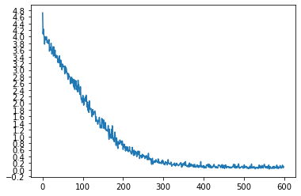

# 中英文自动翻译模型的构建
# Constructing a Chinese-English Automatic Translator

## Main Tech: 

Python / Seq2Seq / Encoder / Decoder / teacher forcing / attention / GRU / LSTM / Embedding / Pytorch

## Introduction：

By learning English and corresponding Chinese translation, a machine translation model is established. This project can be applied to machine translation between various languages, and embedding feature learning can be performed on words in various languages.

## Main Process：
* One-hot encoding the English and Chinese translation data sets
* Establishing a Seq2Seq learning model
* Encoding the input through the Encoder to obtain feature vectors, and then decoding through the attension Decoder
* Using GRU to complete feature extraction of time series data
* Finally, use the learned machine translation model to translate English sentences

### Loss of the model

### Model evaluation

> i m looking over his report .
= ['我', '在', '阅读', '他', '的', '报告', '。']
< 我 在 阅读 他 的 报告 。 <EOS>

> he is living abroad at the moment .
= ['他', '现在', '住', '在', '国外', '。']
< 他 现在 住 在 国外 。 <EOS>

> she s my type .
= ['她', '是', '我', '的', '菜', '。']
< 她 是 我 的 菜 。 <EOS>

> we re out of stock now .
= ['我们', '现在', '缺乏', '库存', '。']
< 我们 现在 缺乏 库存 。 <EOS>

> he s such a sweetheart .
= ['他', '真是', '甜心', '。']
< 他 真是 甜心 。 <EOS>

> they are eating their apples .
= ['他們', '在', '吃', '他們', '的', '蘋果', '。']
< 他們 在 吃 他們 的 蘋果 。 <EOS>

> we are traveling on a tight budget .
= ['我們', '很', '節省', '地', '旅行', '。']
< 我們 用少 的 預算 旅行 。 <EOS>

> i m free tonight .
= ['我', '今晚', '有空', '。']
< 我 今晚 有空 。 <EOS>

> he s the manager of the marketing department .
= ['他', '是', '营销部', '的', '负责人', '。']
< 他 是 营销部 的 负责人 。 <EOS>

> he is married to an american lady .
= ['他', '和', '一个', '美国', '女人', '结婚', '了', '。']
< 他 和 一个 美国 女人 结婚 了 。 <EOS>

## Notes about Sequence to Sequence

### Thinking1：What is AutoEncoder?
### Ans: 
Autoencoder is an unsupervised artificial neural network that learns how to efficiently compress and encode data then learns how to reconstruct the data back from the reduced encoded representation to a representation that is as close to the original input as possible.
Autoencoder, by design, reduces data dimensions by learning how to ignore the noise in the data.
Autoencoders consists of 4 main parts:
1. Encoder: In which the model learns how to reduce the input dimensions and compress the input data into an encoded representation.
2. Bottleneck: which is the layer that contains the compressed representation of the input data. This is the lowest possible dimensions of the input data.
3. Decoder: In which the model learns how to reconstruct the data from the encoded representation to be as close to the original input as possible.
4. Reconstruction Loss: This is the method that measures measure how well the decoder is performing and how close the output is to the original input.

### Thinking2：What is the difference between Greedy Search and Beam Search?
### Ans:
***Greedy Search algorithm selects one best candidate as an input sequence for each time step***. Choosing just one best candidate might be suitable for the current time step, but when we construct the full sentence, it may be a sub-optimal choice.

***The beam search algorithm selects multiple alternatives for an input sequence at each timestep based on conditional probability.*** The number of multiple alternatives depends on a parameter called Beam Width B. At each time step, the beam search selects B number of best alternatives with the highest probability as the most likely possible choices for the time step.

### Thinking3：Why should we use Attention?
### Ans:
The encoder encodes the complete information of the source sequence into a single real-valued vector, also known as the context vector.
however,if the input sentence is too long, it is hard for a single vector from the encoder to hold all the relevant information to provide to the decoder.And this will cause problem. Fortunately, attention mechanisms help solve the problem. It focus on a few relevant words in a sentence when predicting the target word rather than a single vector holding the information about the entire sentence.

### Thinking4：What are Self-Attention and Multi-head Attention?
### Ans:
1. ***Self-attention***, also known as intra-attention, is an attention mechanism relating different positions of a single sequence in order to compute a representation of the same sequence.
2. Rather than only computing the attention once, the ***multi-head mechanism** runs through the scaled dot-product attention multiple times in parallel. The independent attention outputs are simply concatenated and linearly transformed into the expected dimensions.

